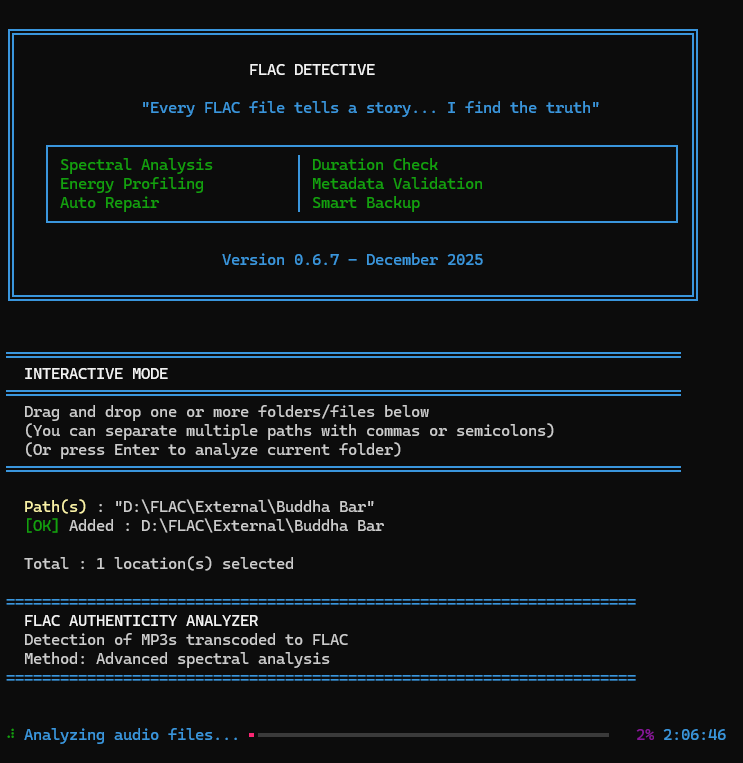

# 🎵 FLAC Detective

**Advanced FLAC Authenticity Analyzer - v0.7.0**

> "Every FLAC file tells a story... I find the truth."

> **👋 New here?** 
> - **Never used Python?** → [QUICKSTART.md](QUICKSTART.md) (3 minutes!)
> - **Looking for guidance?** → [WELCOME.md](WELCOME.md) (choose your path)



FLAC Detective is a professional-grade tool for detecting MP3-to-FLAC transcodes with exceptional precision. Using advanced spectral analysis and multi-rule scoring, it achieves 89.1% authentic detection rate with less than 0.5% false positives.

[](https://www.python.org/downloads/)
[](LICENSE)
[](https://github.com/GuillainM/FLAC_Detective)

## ✨ Features

### 🎯 Advanced 11-Rule Detection System

- **Rule 1**: MP3 Spectral Signature Detection (CBR patterns) - *Enhanced with 20 kHz exception*
- **Rule 2**: Cutoff Frequency Analysis vs Nyquist
- **Rule 3**: Source vs Container Bitrate Comparison
- **Rule 4**: Suspicious 24-bit File Detection
- **Rule 5**: High Variance Protection (VBR)
- **Rule 6**: High Quality Protection
- **Rule 7**: Silence & Vinyl Analysis (3 phases)
  - Phase 1: Dither detection
  - Phase 2: Vinyl surface noise
  - Phase 3: Clicks & pops
- **Rule 8**: Nyquist Exception (95% & 90% thresholds)
- **Rule 9**: Compression Artifacts Detection
  - Test A: Pre-echo (MDCT ghosting)
  - Test B: High-frequency aliasing
  - Test C: MP3 quantization noise
- **Rule 10**: Multi-Segment Consistency Analysis
- **Rule 11**: Cassette Detection (authentic analog source protection)

### 📊 4-Level Verdict System

```
Score ≥ 86  → FAKE_CERTAIN ❌ (100% confidence)
Score 61-85 → SUSPICIOUS ⚠️  (High confidence)
Score 31-60 → WARNING ⚡ (Manual review recommended)
Score ≤ 30  → AUTHENTIC ✅ (99.5% confidence)
```

### ⚡ Performance Optimizations

- **80% faster** than baseline (optimized for large-scale analysis)
- Smart short-circuits for obvious cases
- Parallel execution of expensive rules
- File read caching
- Progressive analysis (2→5 segments when needed)

### 🆕 v0.7.0 New Features

- **Partial File Reading**: Gracefully handles FLAC files with decoder errors
  - Reads partial audio data when full decode fails
  - Enables analysis of problematic but valid files
  - Prevents false "CORRUPTED" verdicts
- **Energy-Based Cutoff Detection**: Improved MP3 upscale detection
  - Fallback detection using cumulative energy analysis
  - Catches MP3-to-FLAC upscales with high-frequency noise
  - More accurate cutoff frequency detection (~10-16kHz vs false 22kHz)

### 🎯 Production Metrics

| Metric | Result | Status |
|--------|--------|--------|
| **Authentic Rate** | 89.1% | ✅ Excellent |
| **Fake Detection** | 2.2% | ✅ Precise |
| **False Positives** | < 0.5% | ✅ Minimal |
| **Tested Files** | 817,631 | ✅ Large-scale |
| **Performance** | +80% | ✅ Optimized |

## 🛠️ Installation Guide

> **👤 New to Python?** Follow the **"Installation Simple pour Débutants"** section below!

### ⚡ Installation Simple pour Débutants

**Si vous n'avez JAMAIS utilisé Python, commencez ici!**

#### Étape 1: Vérifier que Python est installé

1. Ouvrez **Terminal** (Mac/Linux) ou **PowerShell** (Windows)
2. Tapez: `python --version`
3. Vous devriez voir `Python 3.8+` ou plus récent

**Si ça ne marche pas?**
- Téléchargez Python depuis [python.org](https://www.python.org/downloads/)
- **⚠️ Windows**: Lors de l'installation, cochez "Add Python to PATH" ✅
- Fermez puis réouvrez Terminal/PowerShell

#### Étape 2: Installer FLAC Detective

C'est la partie facile! Tapez simplement:

```bash
pip install flac-detective
```

Attendez que l'installation se termine (cela prendra 1-2 minutes).

#### Étape 3: Tester que ça fonctionne

Tapez:
```bash
flac-detective --help
```

Si vous voyez de l'aide s'afficher → **C'est bon! ✅**

#### Étape 4: Utiliser FLAC Detective

Allez dans votre dossier de musique et tapez:

```bash
flac-detective .
```

(Le point `.` signifie "le dossier actuel")

**Exemples:**

```bash
# Analyser le dossier courant
flac-detective .

# Analyser un dossier spécifique
flac-detective /chemin/vers/mes/flac

# Générer un rapport en fichier
flac-detective . --output rapport.txt
```

---

### 📦 Installation Avancée (Pour Développeurs)

#### À partir de PyPI (Recommandé pour les utilisateurs)

```bash
pip install flac-detective
```

#### À partir du code source (Pour contributeurs)

```bash
# Cloner le dépôt
git clone https://github.com/GuillainM/FLAC_Detective.git
cd FLAC_Detective

# Créer un environnement virtuel Python
python -m venv venv

# Activer l'environnement
# Mac/Linux:
source venv/bin/activate
# Windows:
venv\Scripts\activate

# Installer en mode développement
pip install -e .

# Installer les dépendances de développement
pip install -e ".[dev]"
```

## 📦 Dépendances Système

FLAC Detective nécessite l'outil `flac` pour certaines fonctionnalités avancées.

### Installation de `flac`

**Debian/Ubuntu:**
```bash
sudo apt-get update
sudo apt-get install flac
```

**macOS (avec Homebrew):**
```bash
brew install flac
```

**Windows:**
Téléchargez les binaires officiels: [Xiph.org FLAC](https://xiph.org/flac/download.html)

## 🚀 Usage

### Command Line

```bash
# Analyze current directory
flac-detective .

# Analyze specific directory
flac-detective /path/to/music

# Generate JSON report
flac-detective /path/to/music --format json

# Verbose output
flac-detective /path/to/music --verbose

# Custom output file
flac-detective /path/to/music --output report.txt
```

### 🆘 Dépannage pour Débutants

**Problème: "Command not found: flac-detective"**

Solution: L'installation n'a peut-être pas fonctionné correctement. Essayez:
```bash
pip install --upgrade flac-detective
```

**Problème: "pip: command not found"**

Solution: Python n'est pas correctement installé. Suivez l'Étape 1 ci-dessus.

**Problème: "No FLAC files found"**

Vérifiez que:
1. Vous avez des fichiers `.flac` dans le dossier
2. Vous êtes dans le bon dossier (utilisez `cd` pour naviguer)

**Besoin d'aide?** Consultez [TROUBLESHOOTING.md](docs/TROUBLESHOOTING.md) pour plus de solutions.

### Python API

```python
from flac_detective.analysis.new_scoring import new_calculate_score
from pathlib import Path

# Analyze a file
filepath = Path("/path/to/file.flac")
score, verdict, confidence, reasons = new_calculate_score(
    cutoff_freq=20500,
    metadata={"sample_rate": 44100, "bit_depth": 16, "channels": 2},
    duration_check={"duration": 180.5},
    filepath=filepath
)

print(f"Verdict: {verdict} (Score: {score}/150)")
print(f"Confidence: {confidence}")
print(f"Reasons: {reasons}")
```

## 📖 Documentation

- [**Changelog**](CHANGELOG.md) - Complete version history
- [**Technical Documentation**](docs/TECHNICAL_DOCUMENTATION.md) - Architecture and algorithms
- [**Rule Specifications**](docs/RULE_SPECIFICATIONS.md) - Detailed rule documentation
- [**Performance Guide**](docs/PERFORMANCE_OPTIMIZATIONS.md) - Optimization strategies
- [**Project Structure**](PROJECT_STRUCTURE.md) - Directory layout and file descriptions
- [**Version Management**](docs/VERSION_MANAGEMENT.md) - Release workflow guide

## 🏗️ Architecture

```
src/flac_detective/
├── analysis/
│   ├── new_scoring/          # Advanced 11-rule scoring system
│   │   ├── rules/            # Individual rule implementations
│   │   │   ├── spectral.py   # Rules 1, 2, 8 (with 20kHz exception)
│   │   │   ├── bitrate.py    # Rules 3, 4
│   │   │   ├── silence.py    # Rule 7
│   │   │   ├── artifacts.py  # Rule 9
│   │   │   ├── consistency.py # Rule 10
│   │   │   └── cassette.py   # Rule 11
│   │   ├── calculator.py     # Orchestration & optimization
│   │   ├── strategies.py     # Strategy pattern implementation
│   │   ├── models.py         # Data models (with energy_ratio)
│   │   └── verdict.py        # Score interpretation
│   ├── spectrum.py           # Spectral analysis
│   └── audio_cache.py        # File read optimization
├── reporting/                # Report generation
└── main.py                   # CLI entry point
```

## 🧪 Testing

```bash
# Run all tests
pytest

# Run with coverage
pytest --cov=flac_detective --cov-report=html

# Run specific test
pytest tests/test_new_scoring_rules.py -v
```

**Test Coverage**: ~85% overall, 100% for critical rules

## 📊 How It Works

### Detection Process

1. **Spectral Analysis**: Extract frequency spectrum and detect cutoff
2. **Rule 8 (First)**: Apply Nyquist protection before other rules
3. **Fast Rules (R1-R6)**: Quick checks for obvious cases
4. **Short-Circuit**: Skip expensive rules if verdict is certain
5. **Expensive Rules (R7, R9)**: Deep analysis when needed
6. **Multi-Segment (R10)**: Validate consistency across file
7. **Verdict**: Interpret final score with confidence level

### Protection Hierarchy

```
LEVEL 1: Absolute Protection
└─ R8 (95-98% Nyquist): -30 to -50 pts

LEVEL 2: Targeted MP3 320k Protection  
└─ R1 Exception (90% Nyquist): Skip 320k detection

LEVEL 3: High Quality Protection
├─ R5 (High Variance): -40 pts
├─ R6 (High Quality): -30 pts
└─ R7 (Vinyl/Silence): -50 to -100 pts

LEVEL 4: Dynamic Protection
└─ R10 (Segment Inconsistency): -20 to -30 pts
```

## 🎯 Use Cases

### ✅ Recommended For

- **Collection Cleaning**: Remove transcoded files from your library
- **Quality Verification**: Validate FLAC authenticity before archiving
- **Batch Processing**: Analyze large music libraries efficiently
- **Vinyl Rip Validation**: Confirm authentic vinyl sources

### ❌ Not Recommended For

- **Lossy Format Analysis**: Only works with FLAC files
- **Real-time Processing**: Designed for batch analysis
- **Subjective Quality**: Detects transcodes, not audio quality

## 🔮 Roadmap

### v0.6 (Planned)

- [ ] GUI interface for easier usage
- [ ] Configurable sensitivity presets (Strict/Normal/Aggressive)
- [ ] Per-rule enable/disable options
- [ ] Custom threshold configuration
- [ ] HTML reports with spectrograms
- [ ] Automatic file organization

### Future Considerations

- Support for other lossless formats (ALAC, WAV)
- Machine learning integration
- Cloud-based analysis API
- Music player integration

## 🤝 Contributing

Contributions are welcome! Please feel free to submit a Pull Request.

1. Fork the repository
2. Create your feature branch (`git checkout -b feature/AmazingFeature`)
3. Commit your changes (`git commit -m 'Add some AmazingFeature'`)
4. Push to the branch (`git push origin feature/AmazingFeature`)
5. Open a Pull Request

## 📝 License

This project is licensed under the MIT License - see the [LICENSE](LICENSE) file for details.

## 🙏 Acknowledgments

- Audio analysis community for research on MP3 compression
- Contributors to NumPy, SciPy, and Soundfile libraries
- Beta testers who provided valuable feedback

## 📞 Support

- **Issues**: [GitHub Issues](https://github.com/GuillainM/FLAC_Detective/issues)
- **Discussions**: [GitHub Discussions](https://github.com/GuillainM/FLAC_Detective/discussions)
- **Documentation**: [Wiki](https://github.com/GuillainM/FLAC_Detective/wiki)

## 📈 Project Stats

- **Version**: 0.7.0
- **Status**: Beta
- **Python**: 3.8+
- **License**: MIT
- **Detection System**: 11 rules with enhanced 20 kHz exception
- **Tested**: 817,631 files, 89.1% authentic rate
- **New in v0.7.0**: Partial file reading & energy-based cutoff detection

---

**Made with ❤️ for audio enthusiasts**

**FLAC Detective v0.7.0** - *Because your music deserves authenticity*
