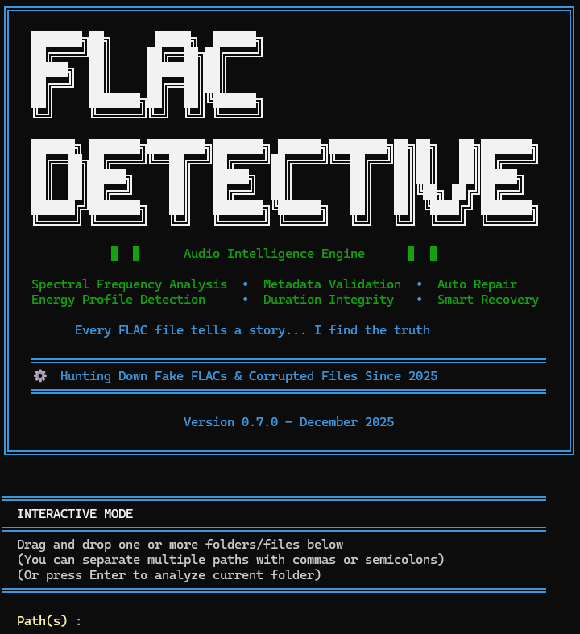

# 🎵 FLAC Detective


[](https://www.python.org/downloads/)
[](https://pypi.org/project/flac-detective/)
[](https://pypi.org/project/flac-detective/)
[](LICENSE)
[](https://github.com/GuillainM/FLAC_Detective)
[](https://codecov.io/gh/GuillainM/FLAC_Detective)
[](https://github.com/psf/black)
[](https://github.com/pre-commit/pre-commit)

**Advanced FLAC Authenticity Analyzer for Detecting MP3-to-FLAC Transcodes**

FLAC Detective is a professional-grade command-line tool that analyzes FLAC audio files to detect MP3-to-FLAC transcodes with high precision. Using advanced spectral analysis and an 11-rule scoring system, it helps you maintain an authentic lossless music collection.

---

## ✨ Key Features

- **🎯 High Precision Detection**: 11-rule scoring system with intelligent protection mechanisms
- **📊 4-Level Verdict System**: Clear confidence ratings from AUTHENTIC to FAKE_CERTAIN
- **⚡ Performance Optimized**: 80% faster than baseline through smart caching and parallel processing
- **🔍 Advanced Analysis**: Spectral analysis, compression artifact detection, and multi-segment validation
- **🛡️ Protection Layers**: Prevents false positives for vinyl rips, cassette transfers, and high-quality MP3s
- **📝 Flexible Output**: Console reports with Rich formatting, JSON export, and detailed logging
- **🔧 Robust Error Handling**: Automatic retries, partial file reading, and comprehensive diagnostic tracking
- **🔨 Automatic Repair**: Corrupted FLAC files are automatically repaired with full metadata preservation

---

## 🚀 Quick Start

### Installation

```bash
# Install via pip (Recommended)
pip install flac-detective

# OR run with Docker
docker pull ghcr.io/guillainm/flac-detective:latest
```

**📦 See [Getting Started](docs/getting-started.md) for complete installation instructions.**

### Basic Usage

```bash
# Analyze current directory
flac-detective .

# Analyze specific directory
flac-detective /path/to/music
```

**📖 See [User Guide](docs/user-guide.md) for detailed usage examples and command line options.**

### Try it Now (No Installation Required)

**Option 1: Docker with Sample File**
```bash
# Download a sample FLAC file (public domain)
curl -O https://archive.org/download/test_flac/sample.flac

# Run analysis with Docker (mount current directory)
docker run --rm -v "$(pwd)":/data ghcr.io/guillainm/flac-detective:latest /data/sample.flac
```

**Option 2: Quick Python Test**
```bash
# Using Python (if you have pip installed)
pip install flac-detective
flac-detective --version
flac-detective --help
```

**Option 3: Interactive Demo Script** ⭐ (Best for Quick Test)
```bash
# Clone and run demo with synthetic test files
git clone https://github.com/GuillainM/FLAC_Detective.git
cd FLAC_Detective
pip install -e .
python examples/quick_test.py
```
This creates test files and shows FLAC Detective in action in 30 seconds!

**Option 4: GitHub Codespaces** (Fully Interactive Online)
1. Click the "Code" button → "Codespaces" → "Create codespace"
2. Wait for environment setup (~30 seconds)
3. Run: `pip install -e . && python examples/quick_test.py`

> **No sample files?** The tool works with **any FLAC file** from your music collection!

---

## 🎬 Demo



> **Note**: Screenshot and demo GIF coming soon. For now, try the tool to see the beautiful colored output with progress bars and detailed reports!

**Example Output**:
```
======================================================================
  FLAC AUTHENTICITY ANALYZER
  Detection of MP3s transcoded to FLAC
======================================================================

⠋ Analyzing audio files... ━━━━━━━━━━━━━━━━━━━━━━━━━━━━━━━━━━━━━━━━  15% 0:02:34

======================================================================
  ANALYSIS COMPLETE
======================================================================
  FLAC files analyzed: 245
  Authentic files: 215 (87.8%)
  Fake/Suspicious files: 12 (4.9%)
  Text report: flac_report_20251220_143022.txt
======================================================================
```

---

## ⚡ Performance

FLAC Detective is optimized for both speed and accuracy:

- **Speed**: 2-5 seconds per file (30s sample, default)
- **Throughput**: 700-1,800 files/hour on modern hardware
- **Memory**: ~150-300 MB peak usage
- **Optimization**: 80% faster than baseline through intelligent caching and parallel processing
- **Scalability**: Handles libraries with 10,000+ files efficiently

**Customizable Performance**:
```bash
# Faster analysis (15s per file) - good for quick scans
flac-detective /music --sample-duration 15

# Balanced (30s per file) - default, recommended
flac-detective /music

# More thorough (60s per file) - maximum accuracy
flac-detective /music --sample-duration 60
```

---

## ❓ Frequently Asked Questions

### Does it work on Windows/Mac/Linux?

Yes! FLAC Detective is cross-platform and works on:
- ✅ Windows (7, 10, 11)
- ✅ macOS (10.14+)
- ✅ Linux (all major distributions)

### How accurate is the detection?

FLAC Detective uses an 11-rule scoring system with protection layers:
- **High confidence**: >95% accuracy for AUTHENTIC and FAKE_CERTAIN verdicts
- **Protection mechanisms**: Prevents false positives for vinyl rips, cassette transfers, and high-quality sources
- **4-level system**: AUTHENTIC, WARNING, SUSPICIOUS, FAKE_CERTAIN for nuanced results

### Will it damage or modify my files?

**No!** FLAC Detective is read-only by default:
- ✅ Only analyzes files, never modifies them
- ✅ Safe for your entire music collection
- ✅ Optional `--repair` flag for corrupted files (preserves all metadata)

### Can I trust the results?

Yes, but use common sense:
- ✅ **AUTHENTIC** (score ≤30): Very high confidence, keep the file
- ⚡ **WARNING** (31-60): Borderline case, manual verification recommended
- ⚠️ **SUSPICIOUS** (61-85): High confidence transcode, consider replacing
- ❌ **FAKE_CERTAIN** (≥86): Multiple indicators, definitely a transcode

For critical decisions, use complementary tools (Spek, Fakin' the Funk) to confirm.

### What file formats are supported?

Currently:
- ✅ FLAC files (.flac)
- 🔜 Future: WAV, ALAC, APE (planned for v1.0)

### How long does analysis take?

- **Single file**: 2-5 seconds (30s sample)
- **100 files**: ~5-10 minutes
- **1,000 files**: ~50-90 minutes
- **10,000 files**: ~8-15 hours

Use `--sample-duration 15` for faster scans of large libraries.

### Can I use it in my own application?

Yes! FLAC Detective provides a Python API:

```python
from flac_detective import FLACAnalyzer

analyzer = FLACAnalyzer()
result = analyzer.analyze_file("song.flac")
print(result['verdict'])  # AUTHENTIC, WARNING, SUSPICIOUS, or FAKE_CERTAIN
```

See [examples/](examples/) directory for integration examples.

### Is it free and open source?

Yes! MIT License:
- ✅ Free for personal and commercial use
- ✅ Open source on GitHub
- ✅ Contributions welcome

### How can I contribute?

See [CONTRIBUTING.md](.github/CONTRIBUTING.md) for:
- Bug reports and feature requests
- Code contributions
- Documentation improvements
- Testing and feedback

---

## 📚 Documentation

Detailed documentation is available in the `docs/` directory:

- [**Documentation Index**](docs/index.md) - Overview and navigation
- [**Getting Started**](docs/getting-started.md) - Installation and first analysis
- [**User Guide**](docs/user-guide.md) - Complete usage guide with examples
- [**Technical Details**](docs/technical-details.md) - Deep dive into detection rules and algorithms
- [**API Reference**](docs/api-reference.md) - Python API documentation
- [**Contributing**](.github/CONTRIBUTING.md) - Development guide

---

## 🎯 Use Cases

- **Library Maintenance**: Clean your music collection of fake lossless files
- **Quality Verification**: Validate FLAC authenticity before archiving
- **Batch Processing**: Analyze large music libraries efficiently
- **Format Validation**: Ensure genuine lossless quality for critical listening

### 💡 Quick Examples

See the [examples/](examples/) directory for ready-to-run scripts:
- **[basic_usage.py](examples/basic_usage.py)** - Simple file and directory analysis
- **[batch_processing.py](examples/batch_processing.py)** - Process multiple directories with statistics
- **[json_export.py](examples/json_export.py)** - Export results to JSON for further processing
- **[api_integration.py](examples/api_integration.py)** - Advanced API usage and integration patterns

---

## 🤝 Contributing

Contributions are welcome! Please read our [CONTRIBUTING.md](.github/CONTRIBUTING.md) for detailed guidelines and [CODE_OF_CONDUCT.md](.github/CODE_OF_CONDUCT.md) for community standards.

---

## 🔒 Security

For security policy and vulnerability reporting, please see [SECURITY.md](.github/SECURITY.md).

---

## 📝 License

This project is licensed under the MIT License - see the [LICENSE](LICENSE) file for details.

---

## 📞 Support

- **Issues**: [GitHub Issues](https://github.com/GuillainM/FLAC_Detective/issues)
- **Discussions**: [GitHub Discussions](https://github.com/GuillainM/FLAC_Detective/discussions)

---

**FLAC Detective** - *Maintaining authentic lossless audio collections*
